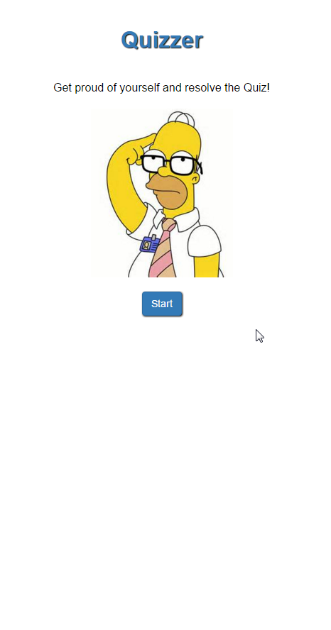

# quizzer
Build a simple quizz with Angulajs

The score to a pass or fail is easy editable, same as the questions, wich make the app really reusable.

you will find an example of the Json format to read the questions on the file quizz.json

